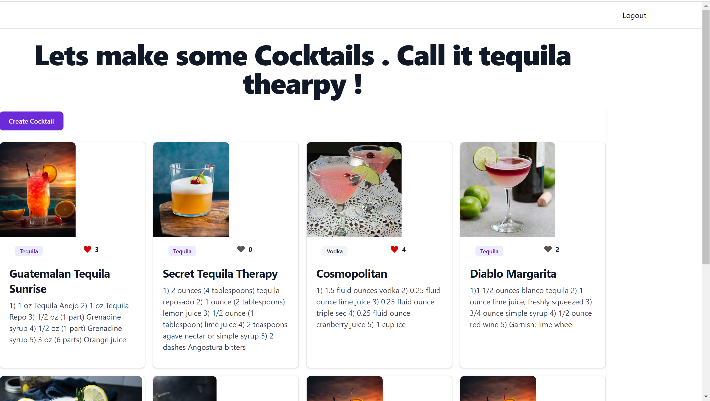

# Cocktail Recipe Maker

Dive into the art of mixology by creating, sharing and favoriting your cocktail recipes.


## Tech Stack

**Client:** EJS, Javascript, Flowbite,TailwindCSS, FontAwesome, HTML/CSS

**Server:** Node, Express, Passport, Mongoose, MongoDB


## Features

- User login and authentication
- Contribute Community Page with Recipes of your own or favorites by adding your own cocktail recipe
- Favorite or unfavorite your cocktails
- Only delete or update the cocktails you make
- Browse all cocktails made by different users 


## Screenshots




## Run Locally

Clone the project

```bash
  git clone https://github.com/socratic617/fullstackApp-user-login-in.git
```

Go to the project directory

```bash
  cd fullstackApp-user-login-in
```

Install dependencies

```bash
  npm install
```

Start the server

```bash
  npm start
```


## Lessons Learned

Something new I learned was how to add a favorite feature where instead of allowing the and showing the user which recipes they had favorited. I had to add a reactions property that would store the information on who has favorited this recipe.

I learned how to use EJS switch and if/else to add different tags to my recipes depending on the recipes.

I needed to learn how to use user authentication to allow my user to login in and sign out of my site.

I used some more advanced tailwind/flowbite templates to such as modals and a grid to improve the appearance of my site.

